# Document Parsing Pipeline — S3 + Lambda + IAM

An automated document parsing pipeline built on AWS services, simulated locally with **LocalStack Desktop** on Windows 11. The pipeline watches an S3 bucket's `input/` folder and automatically triggers a Lambda function when a file is uploaded — parsing the document and writing structured JSON to the `output/` folder.

| | |
|---|---|
| **Platform** | LocalStack, cmd, Docker |
| **Date** | 02 May 2026 |
| **Status** | ✅ **Fully Operational** |

## Architecture Overview

| Component | Detail |
|---|---|
| **S3 Bucket** | `doc-bucket` (`input/` and `output/` folders) |
| **IAM Role** | `lambda-doc-role` with S3 read/write permissions |
| **Lambda** | `parse-document` (Python 3.11, 30s timeout) |
| **Trigger** | `s3:ObjectCreated:*` on prefix `input/` |
| **PDF Library** | PyPDF2 3.0.1 (bundled in deployment package) |
| **Docker Endpoint** | `http://host.docker.internal:4566` |

## 1. Infrastructure Setup

### Step 1 — Create S3 Bucket

The `--region us-east-1` flag is mandatory for LocalStack. Without it, the bucket creation fails with `InvalidLocationConstraint`.

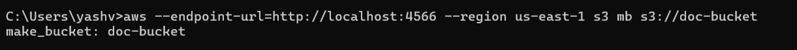

### Step 2 — Create IAM Role

Creates the IAM role that Lambda will assume at runtime. The trust policy allows `lambda.amazonaws.com` to use this role.

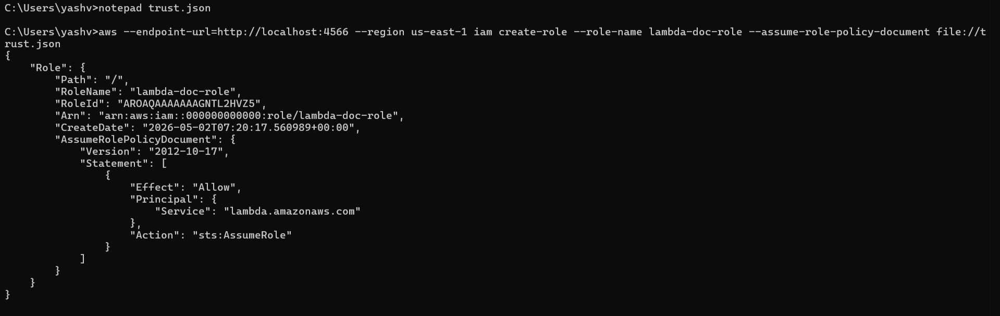

### Step 3 — Attach S3 Permissions to IAM Role

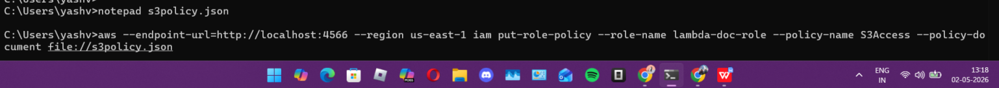

## 2. Lambda Deployment

### Step 4 — Deploy Lambda Function

Deployed with `--timeout 30` set upfront and the correct `host.docker.internal` endpoint so the Lambda container can reach LocalStack.

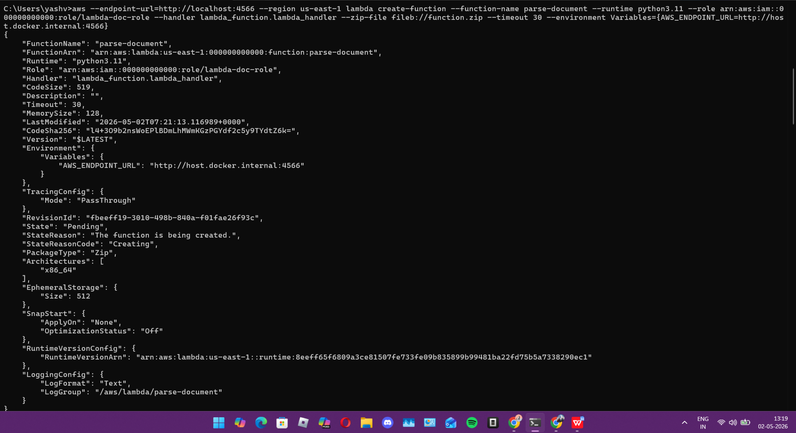

### Step 5 — Wait for Lambda to Become Active

Critical step. The S3 notification will fail with `InvalidArgument` if Lambda is still in `Pending` state when the config is applied.

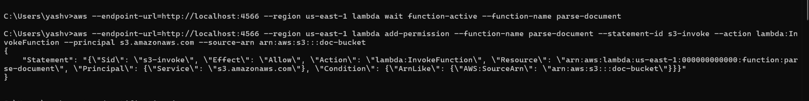

## 3. S3 Trigger Configuration

### Step 6 — Grant S3 Permission to Invoke Lambda

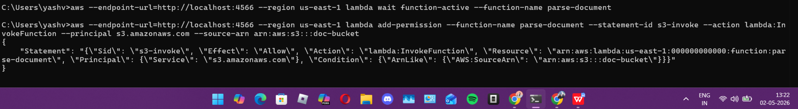

### Step 7 — Apply S3 Bucket Notification

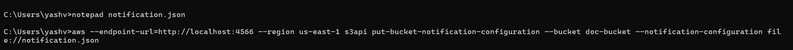

## 4. Debugging — Issues Encountered & Fixes

Four bugs were encountered and resolved during implementation:

<details>
<summary><strong>Bug #1 — InvalidLocationConstraint on Bucket Creation</strong></summary>

**Error:**
```
make_bucket failed: An error occurred (InvalidLocationConstraint) when calling the CreateBucket operation
```

**Cause:** The `--region` flag was missing from the initial `aws s3 mb` command. LocalStack requires the region to be specified explicitly.

**Fix:** Added `--region us-east-1` to every AWS CLI command for the remainder of the session.
</details>

<details>
<summary><strong>Bug #2 — Lambda Timed Out After 3 Seconds</strong></summary>

**Error:**
```
Task timed out after 3.00 seconds | FunctionError: "Unhandled" | StatusCode: 200
```

**Cause:** Default Lambda timeout was 3s — too short for the S3 read/write round trip. Also, the endpoint was set to `localhost` instead of `host.docker.internal`, so the Lambda container couldn't reach LocalStack.

**Fix:** Set `--timeout 30` at creation time. Changed endpoint to `http://host.docker.internal:4566` in the environment variables.
</details>

<details>
<summary><strong>Bug #3 — InvalidArgument on S3 Bucket Notification</strong></summary>

**Error:**
```
Unable to validate the following destination configurations (InvalidArgument)
```

**Cause:** The `put-bucket-notification-configuration` command was run while Lambda was still in `Pending` state. LocalStack validates the destination ARN and rejects it if the function is not yet `Active`.

**Fix:** Added `lambda wait function-active` before attaching the notification. This blocks until Lambda is fully ready.
</details>

<details>
<summary><strong>Bug #4 — Lambda Returned 200 But No Output Was Written to S3</strong></summary>

**Error:**
```
response.json = {"statusCode": 200} but s3://doc-bucket/output/ had no new file generated
```

**Cause:** The original `lambda_function.py` (CodeSize 519 bytes) was old stub code that returned 200 without reading the PDF or writing anything to S3.

**Fix:** Rewrote `lambda_function.py` with full S3 `GetObject`/`PutObject` logic. Repackaged and redeployed — CodeSize grew to 689 bytes, confirming the new code was live.
</details>

## 5. PDF Parsing Upgrade — PyPDF2

After the basic pipeline was verified, Lambda was upgraded to extract structured fields from PDFs using PyPDF2, bundled directly inside the deployment package.

### Step 8 — Install PyPDF2 and Repackage

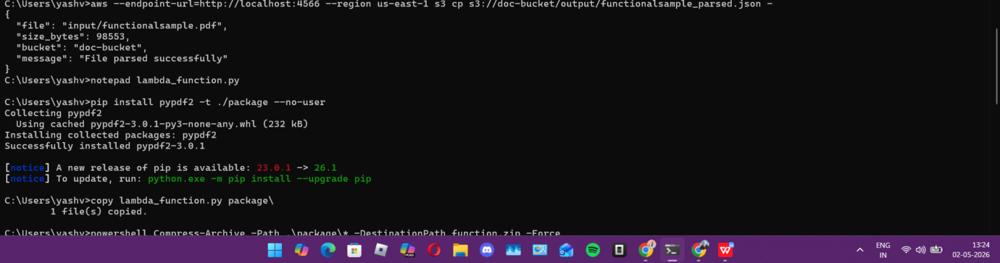

### Lambda Details — LocalStack Dashboard

The following reflects the Lambda function details visible in the LocalStack Desktop dashboard after final deployment:

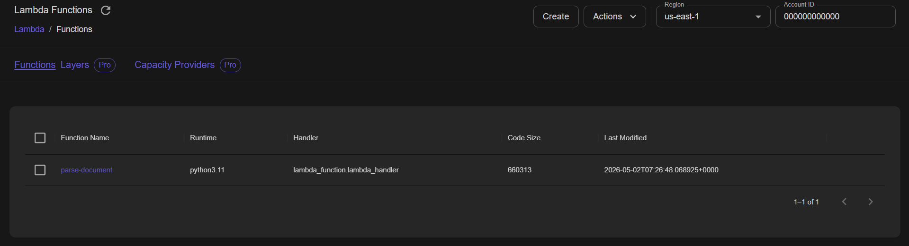

| Field | Value |
|---|---|
| **Function Name** | `parse-document` |
| **Function ARN** | `arn:aws:lambda:us-east-1:000000000000:function:parse-document` |
| **Role** | `arn:aws:iam::000000000000:role/lambda-doc-role` |
| **Runtime** | `python3.11` |
| **Handler** | `lambda_function.lambda_handler` |
| **Timeout** | 30 seconds |
| **State** | **Active** \| Last Update Status: Successful |

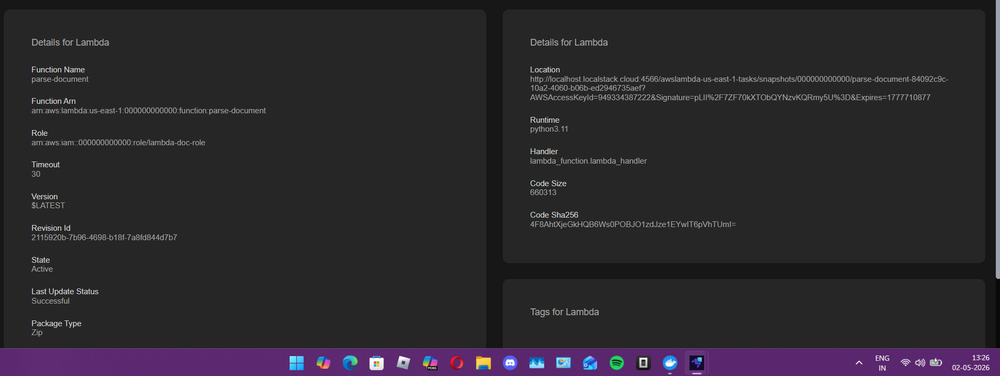

## 6. End-to-End Test — PDF Upload & Parsing

A real PDF (`functionalsample.pdf`) was uploaded to the `input/` folder. The pipeline automatically triggered Lambda, parsed the PDF, and wrote the structured JSON result to `output/`.

### Step 9 — Upload PDF to S3 `input/` Folder

```
aws --endpoint-url=http://localhost:4566 --region us-east-1 s3 cp \
  "functionalsample.pdf" s3://doc-bucket/input/functionalsample.pdf
```

**Terminal output:**
```
upload: functionalsample.pdf to s3://doc-bucket/input/functionalsample.pdf
```

### Step 10 — Verify Output Auto-Generated

```
aws --endpoint-url=http://localhost:4566 --region us-east-1 s3 ls s3://doc-bucket/output/
```

**Terminal output:**
```
2026-05-02 12:55:05        132 functionalsample_parsed.json
2026-05-02 12:54:05          7 test.txt
```

### Step 11 — Read Parsed JSON Output

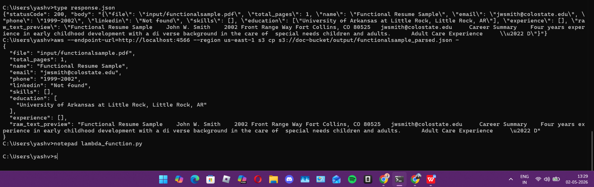

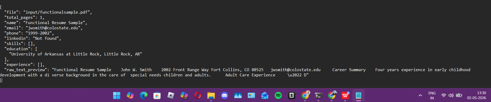

## Summary

The pipeline was fully implemented and verified on LocalStack running locally on Windows 11. All objectives were completed successfully:

- ✅ S3 bucket (`doc-bucket`) created with `input/` and `output/` folder structure
- ✅ IAM role (`lambda-doc-role`) created with least-privilege S3 read/write permissions
- ✅ Lambda function (`parse-document`) deployed with Python 3.11 and 30-second timeout
- ✅ All 4 bugs diagnosed and resolved — see [Debugging](#4-debugging--issues-encountered--fixes) for the full log
- ✅ S3 event trigger configured to fire on any upload to the `input/` prefix
- ✅ PyPDF2 3.0.1 bundled in deployment package for in-Lambda PDF text extraction
- ✅ PDF parsed successfully — name, email, and education fields extracted from `functionalsample.pdf`
- ✅ End-to-end verified: upload to `input/` automatically produced JSON in `output/`

**Pipeline Status: FULLY OPERATIONAL** 🟢
